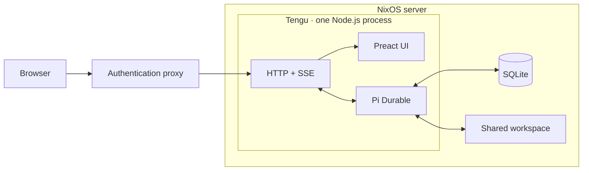

# Tengu architecture

## Purpose

Tengu is a minimal web interface for Pi Durable. It lets one trusted user run
Pi coding agents from a phone or desktop browser and return to work after the
browser or server restarts.

Tengu is not an agent platform, IDE, repository manager, or second scheduler.
It is a thin web adapter around Pi Durable.

## Principles

- Let Pi Durable own conversations, execution, queues, events, and recovery.
- Keep one package, one process, one database, and one shared workspace.
- Use Pi Durable concepts directly instead of wrapping them in new abstractions.
- Prefer platform APIs and explicit code over frameworks.
- Add a dependency or configuration option only for a demonstrated need.
- Keep the browser disposable; committed server state is authoritative.
- Make every primary action operable with a keyboard.
- Measure before adding caches, concurrency controls, or rendering machinery.

## Version 1

The first useful version does one thing well:

```text
open SQLite → open Pi Durable → create or select a conversation
→ submit a prompt → stream committed events → render them
→ restart → reconnect and continue
```

It includes:

- several concurrent conversations;
- one shared working directory visible to every conversation;
- Pi's coding tools, including `read`, `write`, `edit`, and `bash`;
- automatic tool execution;
- an isolated, minimal Pi configuration;
- responsive conversation navigation and chat;
- reproducible Nix packaging and a small NixOS module.

It does not include:

- user accounts or collaboration;
- repository, branch, or worktree management;
- per-chat filesystems or sandboxes;
- approval prompts;
- a terminal, file browser, Git UI, or settings UI;
- personal skills, extensions, themes, or prompt templates;
- notifications, schedules, plugins, or subagent-specific UI;
- a custom task queue or concurrency scheduler.

## Architecture



The Node process is the sole owner of the SQLite file. It serves the compiled
web application, accepts a few commands, and forwards Pi Durable state to the
browser. It listens on loopback and relies on a separately configured
authentication proxy for remote access.

There is no application database beside Pi Durable's storage, no background
worker, no message broker, and no separate agent service.

## Technology

Tengu is one TypeScript package.

The server uses Node.js and its built-in HTTP APIs. It integrates Pi Durable,
Pi's model packages, and the coding extension directly. A routing framework is
not needed for the small version 1 API.

The browser uses Preact, TypeScript, Vite, native `fetch`, and `EventSource`.
Styles are plain CSS. There is no full-stack framework, server rendering,
utility-CSS framework, component library, GraphQL layer, or general-purpose
client state library.

Markdown output must be sanitized. A small Markdown dependency is acceptable
because implementing a correct parser and sanitizer is not part of Tengu's
purpose.

## Runtime

At startup, the process:

1. opens Pi Durable's Node SQLite storage;
2. creates the model registry and installs the coding extension;
3. creates a `NodeExecutionEnv` rooted at the shared workspace;
4. opens the Pi Durable harness and resumes unfinished work;
5. starts the loopback HTTP listener.

Each chat is a Pi Durable conversation. Tengu does not add a separate chat
model. Every conversation uses the same working directory and can see the same
files. The agent decides how to clone repositories, create branches or
worktrees, run tests, commit, push, and open pull requests when asked.

Pi Durable runs conversations concurrently. Version 1 adds no process-level
scheduler or arbitrary concurrency limit. If real measurements show that the
host needs protection, a limit can be designed then.

Shared filesystem access means concurrent agents can conflict. Tengu does not
try to infer or prevent this. The user can instruct agents to create separate
worktrees when tasks overlap.

## State and recovery

Pi Durable is the only source of truth for transcripts, live calls, inboxes,
usage, tasks, and recovery. Tengu must not mirror that state into its own tables.

The SQLite database lives in the service state directory. After a restart,
Tengu opens the same file, installs the same tools, and resumes the harness.
Committed work continues from Pi Durable's last checkpoint.

The browser connects to one conversation event stream. The server sends the
current Pi Durable snapshot, then forwards committed event batches. A reconnect
starts with a fresh snapshot; Tengu does not maintain a replay log beside Pi
Durable. Partial messages and tool output update in place.

Prompt submissions use a browser-generated request ID and Pi Durable's native
idempotency so a retried HTTP request cannot create duplicate work.

## HTTP surface

Version 1 should need only:

- `GET /api/conversations` — list conversations;
- `POST /api/conversations` — create a conversation;
- `GET /api/conversations/:id/events` — stream the snapshot and events;
- `POST /api/conversations/:id/input` — submit an input;
- `POST /api/conversations/:id/steer` — steer busy work;
- `POST /api/conversations/:id/stop` — stop the current run.

The server performs direct method and payload checks. It should expose only the
small amount of data the UI consumes, but it should not introduce a generic DTO,
versioning, validation, or service framework.

SSE responses disable buffering and send an occasional keepalive. Unknown
routes return a plain error. Request bodies have a small fixed limit.

## Interface

The interface has two views:

- a conversation list with a new-chat action;
- the selected conversation with messages, tool calls, status, and composer.

Desktop shows the list beside the conversation. Mobile shows it as a drawer.
Tool calls appear as compact collapsed cards. The composer sends a new input,
steers active work, or stops it.

The UI applies Pi Durable snapshots and events directly through a small reducer.
It does not maintain a parallel domain model. Components subscribe only to the
state they render so streaming output does not rerender the entire page.

Use semantic controls, visible focus, keyboard navigation, reduced-motion
preferences, system fonts, and accessible status announcements. Global keyboard
shortcuts map keys directly to application functions in one place. They are
accelerators, not replacements for native controls or normal focus order, and
unmodified shortcuts do not fire while the user is typing. Do not add
virtualization until a measured transcript proves it necessary.

## Files and configuration

Runtime data is intentionally small:

```text
/var/lib/tengu/
├── tengu.sqlite
├── workspace/
└── home/
```

The service user's isolated home contains provider and Git authentication but
no inherited interactive Pi configuration. Secrets come from a protected file
outside the Nix store.

Application configuration is limited to values required to start:

- listen host and port;
- state file;
- workspace path;
- provider and default model.

Avoid configuration for behavior that version 1 does not implement.

## Nix

The repository exposes:

- one application package;
- one development shell;
- one small NixOS module.

The module provides the package, loopback address, port, workspace, environment
file, provider, and model. It creates a dedicated unprivileged service user and
a state directory, then runs Tengu as one systemd service with restart on
failure.

The package contains compiled server code and static browser assets. Runtime
state is never written into the Nix store. The module should remain a deployment
wrapper, not a second configuration system.

## Security

Tengu assumes one trusted user authenticated by an external proxy. It binds to
loopback and has no login system of its own.

The service user is the primary boundary. It has no sudo access and cannot read
other users' homes or unrelated service secrets. It can write only its own home,
state, cache, and shared workspace. Git credentials should be scoped narrowly.

The authenticated user can ask the agent to run arbitrary commands as the
service account. Tengu does not sandbox untrusted repositories. The
authentication proxy therefore needs protection comparable to SSH access.

The server limits request sizes, verifies the expected origin for mutations,
sanitiszes rendered Markdown, and avoids logging prompts, tool output, and
credentials by default.

## Operations

Logs go to stdout and systemd collects them. Version 1 needs readable startup,
request error, and agent failure messages, not a logging framework or telemetry
pipeline.

On termination, the server stops accepting requests, closes event streams, and
closes the Pi Durable harness. Already committed work remains resumable.

Backing up the SQLite state preserves conversations. Backups must include a
consistent SQLite snapshot rather than copying only the main file while WAL is
active. The workspace may be backed up independently.

## Tests

Tests protect the thin integration rather than every implementation detail:

1. opening SQLite, creating a conversation, and submitting input;
2. receiving an initial snapshot and streamed updates;
3. reconnecting and receiving current committed state;
4. restarting the process and resuming unfinished work;
5. running two conversations against the shared workspace;
6. building the package and starting the NixOS service on loopback;
7. rendering the core flow on desktop and mobile.

Tests use a deterministic fake model wherever possible. One manual acceptance
test uses a real provider and asks the agent to clone a repository, change it,
test it, and open a pull request.

## Build order

1. Create the single TypeScript package, Vite page, tests, and Nix development
   shell.
2. Open Pi Durable with SQLite, coding tools, and the shared workspace.
3. Prove submit, event streaming, restart, and resume with a fake model.
4. Add the six HTTP endpoints.
5. Build the minimal responsive conversation interface.
6. Package the application and add the NixOS module.
7. Run the real-provider acceptance test.

## Add later only when needed

- tool confirmation;
- sandboxed execution;
- repository-aware features;
- extra Pi configuration or extensions;
- conversation rename, archive, search, or retention controls;
- notifications and schedules;
- subagent visualization;
- multiple users;
- concurrency limits;
- richer health checks, metrics, or structured telemetry.
